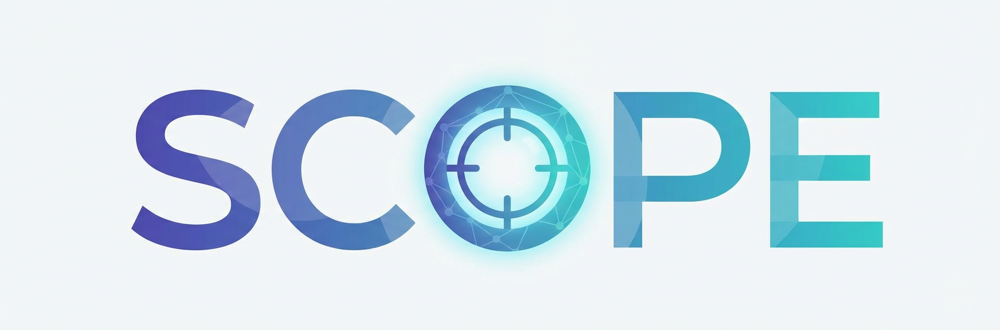

<p align="center">
  
</p>

<p align="center">
  <strong>通过提示词进化实现自演化上下文优化</strong>
</p>

<p align="center">
  一个从智能体执行轨迹中自动学习并优化提示词的框架
</p>

<p align="center">
  <a href="#安装">安装</a> •
  <a href="#快速开始">快速开始</a> •
  <a href="#工作原理">工作原理</a> •
  <a href="#api-参考">API</a> •
  <a href="#配置">配置</a>
</p>

<p align="center">
  <a href="https://arxiv.org/abs/2512.15374"></a>
  <a href="https://pypi.org/project/scope-optimizer/"></a>
  
  <a href="https://github.com/JarvisPei/SCOPE/actions"></a>
  
  <a href="CONTRIBUTING.md"></a>
</p>

<p align="center">
  <a href="../README.md">English</a> | <strong>中文</strong>
</p>

---

## 概述

**SCOPE** 将静态的智能体提示词转变为能够从自身执行中学习的自演化系统。SCOPE 无需手动编写提示词，而是自动从执行轨迹中合成指导规则，持续提升智能体性能。

📄 **论文:** [SCOPE: Prompt Evolution for Enhancing Agent Effectiveness](https://arxiv.org/abs/2512.15374)

**核心特性:**
- 🔄 **自动学习** — 从错误和成功模式中合成指导规则
- 📊 **双流记忆** — 战术记忆（任务特定）+ 战略记忆（跨任务）
- 🎯 **Best-of-N 选择** — 生成多个候选规则并选择最优
- 🧠 **记忆优化** — 自动合并和去重规则
- 🔌 **通用模型支持** — 支持 OpenAI、Anthropic 以及通过 LiteLLM 的 100+ 模型提供商

## 安装

```bash
pip install scope-optimizer
```

**从源码安装:**

```bash
git clone https://github.com/JarvisPei/SCOPE.git
cd SCOPE
pip install -e .
```

## 快速开始

```python
import asyncio
from dotenv import load_dotenv
from scope import SCOPEOptimizer
from scope.models import create_openai_model

load_dotenv()  # 从 .env 文件加载 API 密钥

async def main():
    model = create_openai_model("gpt-4o-mini")
    optimizer = SCOPEOptimizer(
        synthesizer_model=model,
        exp_path="./scope_data",  # 战略规则持久化存储路径
    )
    
    # 用之前学习的战略规则初始化提示词
    base_prompt = "你是一个有帮助的助手。"
    strategic_rules = optimizer.get_strategic_rules_for_agent("my_agent")
    current_prompt = base_prompt + strategic_rules  # 应用跨任务知识
    
    while not task_complete:
        # ... 你的智能体逻辑 ...
        
        # 每一步后调用 SCOPE
        result = await optimizer.on_step_complete(
            agent_name="my_agent",
            agent_role="AI 助手", 
            task="回答用户问题",
            model_output="...",
            error=error_if_any,  # 发生错误时传入
            current_system_prompt=current_prompt,
            task_id="task_001",
        )
        
        # 应用生成的指导规则
        if result:
            guideline, guideline_type = result  # guideline_type: "tactical" 或 "strategic"
            current_prompt += f"\n\n## 学习到的规则:\n{guideline}"

asyncio.run(main())
```

## 工作原理

SCOPE 通过四个关键机制运作：

### 1. 指导规则合成 (π_φ, π_σ)

当发生错误或检测到质量问题时，SCOPE 使用生成器 (π_φ) **生成**多个候选指导规则，并使用选择器 (π_σ) **选择**最佳候选。

### 2. 双流路由 (π_γ)

指导规则被分类并路由到相应的记忆：

| 流类型 | 范围 | 持久化 | 示例 |
|--------|------|--------|------|
| **战术** | 任务特定 | 仅内存 | "此 API 限速 10次/分钟" |
| **战略** | 跨任务 | 保存到磁盘 | "解析前始终验证 JSON" |

### 3. 记忆优化 (π_ω)

战略记忆通过冲突解决、包含剪枝和合并进行自动优化。

### 4. 提示词进化

```
θ_new = θ_base ⊕ M_strategic ⊕ M_tactical
```


## API 参考

### SCOPEOptimizer

```python
optimizer = SCOPEOptimizer(
    # 必需参数
    synthesizer_model,              # 用于规则合成的模型实例（如 gpt-4o-mini）
    exp_path="./scope_data",        # 存储战略规则和历史的路径
    
    # 分析设置
    enable_quality_analysis=True,   # 是否分析成功步骤以寻找改进（默认: True）
    quality_analysis_frequency=1,   # 每 N 个成功步骤分析一次质量（默认: 1）
    auto_accept_threshold="medium", # 置信度阈值: "all", "low", "medium", "high"（默认: "medium"）
    
    # 记忆设置
    max_rules_per_task=20,          # 每个任务最大战术规则数（默认: 20）
    strategic_confidence_threshold=0.85,  # 晋升为战略规则的最小置信度（默认: 0.85）
    max_strategic_rules_per_domain=10,    # 每个智能体每个领域的最大战略规则数（默认: 10）
    
    # 合成设置
    synthesis_mode="thoroughness",  # "efficiency"（快速）或 "thoroughness"（全面，默认）
    use_best_of_n=False,            # 启用 Best-of-N 候选选择（默认: False）
    candidate_models=None,          # Best-of-N 的额外模型（默认: None）
    
    # 高级设置
    optimizer_model=None,           # 用于规则优化的独立模型（默认: synthesizer_model）
    enable_rule_optimization=True,  # 记忆满时自动优化战略记忆（默认: True）
    store_history=False,            # 将规则生成历史存储到磁盘（默认: False）
)
```

### on_step_complete

```python
# 每个智能体步骤后调用
result = await optimizer.on_step_complete(
    # 必需参数
    agent_name="my_agent",          # 智能体的唯一标识符
    agent_role="AI 助手",           # 智能体的角色/描述
    task="完成用户请求",            # 当前任务描述
    
    # 步骤上下文（error/model_output/observations 至少需要一个）
    model_output="智能体的响应...",  # 模型的输出文本（默认: None）
    tool_calls="[{...}]",           # 尝试的工具调用（字符串格式，默认: None）
    observations="工具结果...",      # 收到的观察/工具结果（默认: None）
    error=exception_if_any,         # 步骤失败时的异常（默认: None）
    
    # 提示词上下文
    current_system_prompt=prompt,   # 当前系统提示词（包含战略规则）
    
    # 可选设置
    task_id="task_001",             # 用于追踪的任务标识符（默认: None）
    truncate_context=True,          # 为效率截断长上下文（默认: True）
)

# 返回: Tuple[str, str] 或 None
# - 成功时: (guideline_text, guideline_type)，其中 guideline_type 为 "tactical" 或 "strategic"
# - 跳过/失败时: None
```

### 加载战略规则

```python
# 在智能体初始化时加载战略规则（跨任务学习的关键！）
strategic_rules = optimizer.get_strategic_rules_for_agent("my_agent")
initial_prompt = base_prompt + strategic_rules  # 应用学习到的知识
```

战略规则存储在 `{exp_path}/strategic_memory/global_rules.json`，调用 `get_strategic_rules_for_agent()` 时自动加载。


### 模型适配器

```python
from scope.models import create_openai_model, create_anthropic_model, create_litellm_model

# OpenAI
model = create_openai_model("gpt-4o-mini")

# Anthropic
model = create_anthropic_model("claude-3-5-sonnet-20241022")

# LiteLLM (100+ 提供商)
model = create_litellm_model("gpt-4o-mini")           # OpenAI
model = create_litellm_model("gemini/gemini-1.5-pro") # Google
model = create_litellm_model("ollama/llama2")         # 本地模型
```

### 自定义模型适配器

```python
# 异步适配器（默认）
from scope.models import BaseModelAdapter, Message, ModelResponse

class MyAsyncAdapter(BaseModelAdapter):
    async def generate(self, messages: List[Message]) -> ModelResponse:
        result = await my_api_call(messages)
        return ModelResponse(content=result)  # 返回原始文本

# 同步适配器（用于非异步代码）
from scope.models import SyncModelAdapter

class MySyncAdapter(SyncModelAdapter):
    def generate_sync(self, messages: List[Message]) -> ModelResponse:
        result = requests.post(api_url, json={"messages": ...})
        return ModelResponse(content=result.json()["text"])

# 或包装任意函数（同步或异步）
from scope.models import CallableModelAdapter

def my_model(messages):
    return "response"

model = CallableModelAdapter(my_model)
```

> **注意:** 适配器只需返回原始模型输出。SCOPE 的提示词要求模型返回 JSON，SCOPE 内部处理解析。

## 配置

### 环境变量

通过环境变量或 `.env` 文件设置 API 密钥：

```bash
# 复制模板并编辑
cp .env.template .env
```

```python
from dotenv import load_dotenv
load_dotenv()  # 自动加载 API 密钥
```

查看 [`.env.template`](../.env.template) 了解所有支持的提供商。

### 置信度阈值

| 阈值 | 接受 | 使用场景 |
|------|------|----------|
| `"all"` | 全部 | 激进学习 |
| `"low"` | 低 + 中 + 高 | 平衡 |
| `"medium"` | 中 + 高 | 保守（默认）|
| `"high"` | 仅高 | 非常保守 |

### 合成模式

| 模式 | 描述 |
|------|------|
| `"thoroughness"` | 全面的 7 维度分析（默认）|
| `"efficiency"` | 轻量级、更快的分析 |

### 日志

```python
import logging

logging.getLogger("scope").setLevel(logging.INFO)
logging.getLogger("scope").addHandler(logging.StreamHandler())
```

## 测试

使用内置测试脚本验证您的设置：

```bash
# 快速连接测试
python examples/test_simple.py

# 深度功能测试
python examples/test_scope_deep.py

# 使用自定义模型/提供商
python examples/test_simple.py --model gpt-4o --provider openai
python examples/test_scope_deep.py --model claude-3-5-sonnet-20241022 --provider anthropic
```

运行 `--help` 查看所有选项。

## 开发

```bash
# 安装开发依赖
pip install -e ".[dev]"

# 运行测试
pytest tests/

# 格式化代码
black scope/
ruff check scope/
```

## 引用

如果您发现 SCOPE 对您的研究有帮助，请引用我们的论文：

```bibtex
@article{pei2025scope,
  title={SCOPE: Prompt Evolution for Enhancing Agent Effectiveness},
  author={Pei, Zehua and Zhen, Hui-Ling and Kai, Shixiong and Pan, Sinno Jialin and Wang, Yunhe and Yuan, Mingxuan and Yu, Bei},
  journal={arXiv preprint arXiv:2512.15374},
  year={2025}
}
```

## 许可证

MIT 许可证 - 详见 [LICENSE](../LICENSE)。

